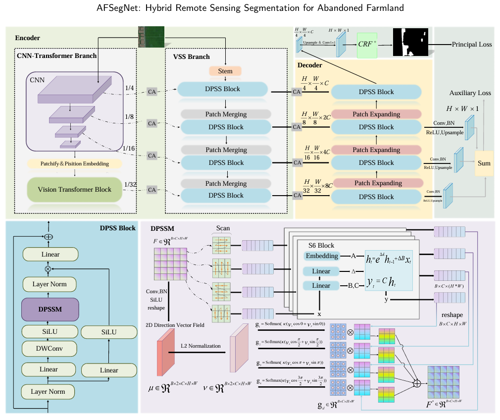
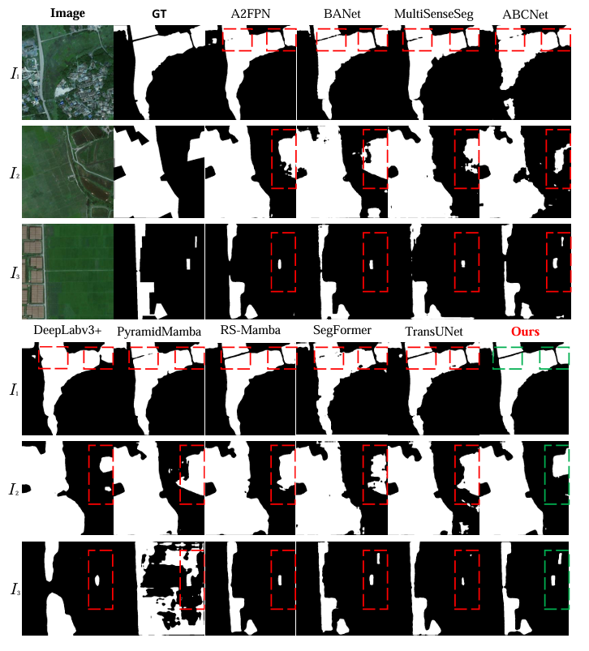

# AFSegNet: Hybrid Remote Sensing Segmentation for Abandoned Farmland with Spatial Structure Modeling and Visual State Space Learning

This repository provides the official implementation and reproducibility materials for **AFSegNet**, a hybrid semantic segmentation framework designed for abandoned farmland extraction from high-resolution remote sensing imagery.



AFSegNet integrates CNN-based local feature extraction, Transformer-based contextual modelling, and visual state space learning within a dual-branch encoder--decoder architecture. A Direction Perception Selective Scan Block (DPSS Block) is introduced to enable direction-aware long-range representation learning, while a lightweight differentiable CRF<sup>+</sup> module is used for local spatial consistency enhancement and boundary refinement.

---

## What Is Abandoned Farmland?

Abandoned farmland refers to agricultural land that was previously cultivated but is no longer actively managed or used for crop production. In remote sensing imagery, abandoned farmland often appears as a transitional land-cover type between cultivated fields and natural vegetation. It may contain mixed herbaceous plants, shrubs, weeds, fragmented crop residues, or gradually recovering vegetation.

Segmenting abandoned farmland from high-resolution remote sensing images is challenging. Unlike regular cropland, abandoned farmland usually has irregular field shapes, weakened or blurred boundaries, heterogeneous textures, and high intra-class variability. Its visual appearance can also be easily confused with surrounding land-cover types such as woodland, grassland, wetlands, paddy fields, and unmanaged vegetation. These characteristics make abandoned farmland segmentation a difficult task for general semantic segmentation models.

<p align="center">
  
</p>

<p align="center">
  <b>Figure.</b> Typical visual challenges in abandoned farmland segmentation, including ambiguous boundaries, irregular shapes, heterogeneous textures, and high intra-class variability.
</p>

---
## News

* The dataset, source code, data split files, evaluation scripts, and reproduction instructions have been released.
* Two versions of the abandoned farmland segmentation dataset are publicly available through Baidu Netdisk.

---

## Dataset

We provide two versions of the abandoned farmland segmentation dataset.

### 512 × 512 Abandoned Farmland Dataset

This version contains the original annotated image patches and is used for the main comparative experiments in the paper.

**Baidu Netdisk:** [512 Abandoned Farmland](https://pan.baidu.com/s/1X4ok7HhKmjRhAAx1Uhz35g)
**Extraction code:** `nx8b`

### 256 × 256 Abandoned Farmland Dataset

This version is generated by dividing each 512 × 512 patch into four non-overlapping 256 × 256 sub-patches. It is provided for lightweight reproduction and module-level computational analysis.

**Baidu Netdisk:** [256 Abandoned Farmland](https://pan.baidu.com/s/1B0AqtrM1aaqXE5dMYtTHxg)
**Extraction code:** `hd9z`

---

## Repository Structure

```text
AFSegNet/
├── configs/                 # Configuration files
├── datasets/                # Datasets
├── models/                  # AFSegNet model and core modules
├── tools/                  
├── splits/                  # Training, validation, and test split files
├── requirements.txt         # Python dependencies
├── train.py/
├── test.py/
└── README.md
```

---


## Installation

We recommend creating a new conda environment:

```bash
conda create -n AFSegNet python=3.8 -y
conda activate AFSegNet
```

Install PyTorch according to your CUDA version, then install the remaining dependencies:

```bash
pip install -r requirements.txt
```

---

## Data Preparation

After downloading the 512 × 512 abandoned farmland dataset from Baidu Netdisk, please first organise the original dataset as follows:

```text
AFSegNet/
└── datasets/
    └── AbandonedFarmland 512/
        ├── images/
        └── labels/
```

The `images/` folder contains the remote sensing images, and the `labels/` folder contains the corresponding pixel-level annotation masks. Please make sure that each image and its corresponding label have the same filename.

Before training, run the dataset splitting script to randomly divide the dataset into training, validation, and test subsets with a ratio of 7:1.5:1.5. During this process, all non-zero pixels in the label masks will be converted to 1, while background pixels remain 0.

```bash
python split_dataset_copy_binary_mask.py \
    --dataset_root "datasets/AbandonedFarmland 512" \
    --output_root "data" \
    --seed 134789831749
```

After running the script, the processed dataset will be generated as follows:

```text
AFSegNet/
└── data/
    ├── train/
    │   ├── images/
    │   └── labels/
    ├── val/
    │   ├── images/
    │   └── labels/
    └── test/
        ├── images/
        └── labels/
```

The random seed ensures that the dataset split is reproducible.To improve reproducibility, the random seeds used for dataset splitting were set as seed = [134789831749, 1628453179, 2043987623, 42, 35]. For reproducing the main comparative experiments, we recommend using the 512 × 512 dataset. The 256 × 256 dataset is mainly intended for lightweight reproduction and module-level computational analysis.


## Training

To train AFSegNet, run:

```bash
python train.py -c config/AbandonedFarmland/AFSegNet.py
```

The training logs and checkpoints will be saved automatically.

---

## Testing and Visualisation

To evaluate a trained model, run:

```bash
python test.py -c config/AbandonedFarmland/AFSegNet.py -o fig_results/af/test
```



---

## Citation

If you use this dataset or code in your research, please cite our work:

```bibtex
@article{zhang2026afsegnet,
  title={AFSegNet: Hybrid Remote Sensing Segmentation for Abandoned Farmland with Spatial Structure Modeling and Visual State Space Learning},
  author={Zhang, Yongsheng and Lai, Shanyan and Ahmad, Tanvir and Zhou, Hui and Ye, Chunyang},
  journal={Ecological Informatics},
  year={2026}
}
```

---

## Contact

For questions regarding the dataset, code, or reproducibility, please contact:

**Yongsheng Zhang**
Email: [yszhang@hainanu.edu.cn](mailto:yszhang@hainanu.edu.cn)

**Corresponding author:** Chunyang Ye
Email: [cyye@hainanu.edu.cn](mailto:cyye@hainanu.edu.cn)

